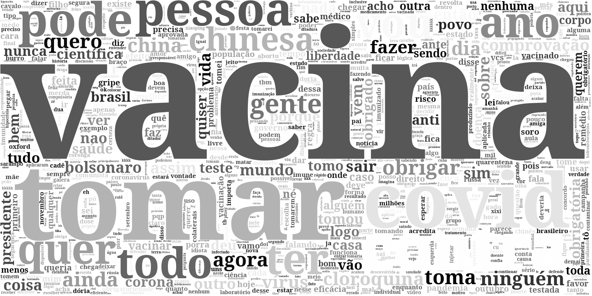

# Nuvem de palavras sobre a hashtag VACINA

Este projeto de nuvem de palavras foi desenvolvido por Eduardo Passos, usando Python, Orange-canvas e outras ferramentas ETL e text mining. O intuito foi de coletar tweets com a hashtag VACINA no para identificar a expectativa das pessoas sobre a vacina contra coronavírus no Brasil, e quais são os trending topics dessa hashtag.

Um agradecimento especial ao meu amigo Tiago Dias (diasctiago), pela criação da função de transformar o arquivo .csv em .txt. 
Valeu, Tiago!

