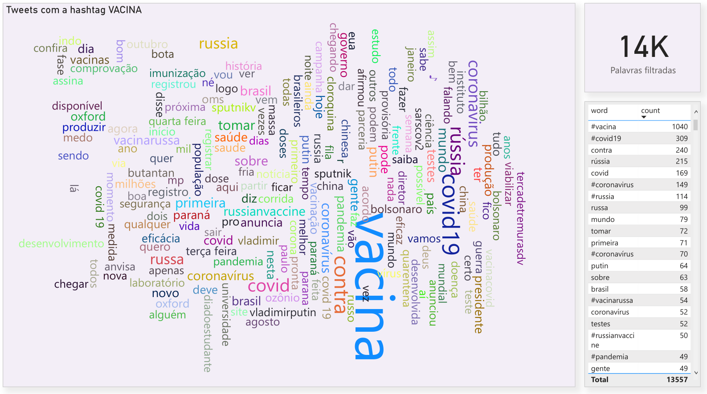

# Word Cloud from Tweets about #vacine
This word cloud project was developed by Eduardo Passos using Python, Orange-canvas and other ETL and text mining tools. It aims to show the results for the hashtag VACINA (vacine in pt-br) on twitter to show the expectation about the coronavirus vacine and what are the trending topics with this word #vacina

